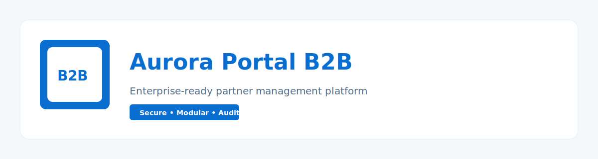

# AuroraPortalB2B

Enterprise-grade backend for the Aurora B2B portal. Modular API, Keycloak auth, and permission-based access control.


**Highlights**
- Modular .NET backend with Partners domain.
- Keycloak integration (OIDC/JWT).
- Permission-based authorization.
- Docker-first local and demo deployment.

**Project Layout**
- `src/` application and modules
- `tests/` unit and integration tests
- `deploy/` local Docker compose files
- `docs/` project documentation
- `scripts/` helper scripts

**Demo Deployment (Render)**
- API: https://aurora-b2b-api.onrender.com
- Swagger: https://aurora-b2b-api.onrender.com/swagger/index.html
- Keycloak: https://aurora-b2b-keycloak.onrender.com
- Deploy status: https://dashboard.render.com

Notes:
- Render Free services sleep when idle; the first request can take ~30–60s.
- If Render assigns different service URLs, update `render.yaml` and redeploy.

## Getting Started

**Build**
```sh
dotnet build
```

**Test**
```sh
./scripts/test.sh
```

**Run (local)**
1. Start Keycloak:
```sh
docker compose -f deploy/docker-compose.keycloak.yml up -d
```
2. Build and run API + partners DB:
```sh
docker compose -f deploy/docker-compose.local.yml up -d --build
```

Swagger is available at `/swagger` when running in Development.

Soft delete: `DELETE` endpoints do not remove records; they set status to `Inactive`.

## Authentication

Configure Keycloak in:
- `src/AuroraPortalB2B.Host/appsettings.json`
- `src/AuroraPortalB2B.Host/appsettings.Development.json`

Example values:
```
Keycloak:Authority = http://localhost:8080/realms/aurora
Keycloak:Audience = aurora-b2b
```

**Get a token (password grant)**
```sh
curl -X POST \
  "http://localhost:8080/realms/aurora/protocol/openid-connect/token" \
  -H "Content-Type: application/x-www-form-urlencoded" \
  -d "client_id=aurora-b2b" \
  -d "grant_type=password" \
  -d "username=test-user" \
  -d "password=test-password"
```

## Database Migrations (EF Core)

Add a migration:
```sh
dotnet ef migrations add <Name> \
  --project src/modules/partners/AuroraPortalB2B.Partners.Infrastructure \
  --output-dir Migrations \
  --no-build
```

Apply migrations to a database:
```sh
PARTNERS_CONNECTION_STRING="Host=localhost;Port=5432;Database=aurora_partners;Username=postgres;Password=postgres" \
dotnet ef database update \
  --project src/modules/partners/AuroraPortalB2B.Partners.Infrastructure \
  --no-build
```

## Changelog & Release

**Changelog**
```sh
./scripts/changelog.sh
```

Install `git-cliff`:
```sh
brew install git-cliff
```
or
```sh
cargo install git-cliff
```

**Release**
`./scripts/publish.sh`:
- generates `CHANGELOG.md`
- commits changelog updates automatically
- creates a `vX.Y.Z` tag based on Conventional Commits
- pushes `main` and tags

Usage:
```sh
./scripts/publish.sh
```

Notes:
- The working tree must be clean (no uncommitted changes).
- Tag format is always `vX.Y.Z`.
